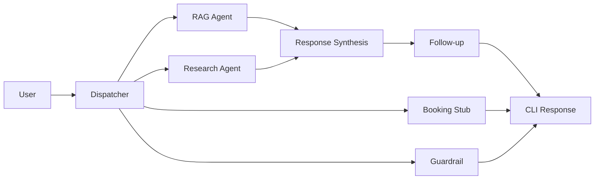

 # TNL-HELP



## Navigating This Repo

1. Read the contract first: [`spec/concierge-spec.md`](spec/concierge-spec.md).
2. Run the 5-query demo flow in [`demo_script.md`](demo_script.md).
3. Check routing and prompt configuration in `config/` and `prompts/`.
4. Review implementation stories in `_bmad-output/implementation-artifacts/`.
5. Inspect memory model in `memory/README.md` and baseline profile `memory/profiles/alex.json`.

## JD Mapping Table

| MVP Item | JD Bullet | Evidence |
|---|---|---|
| Spec-first engineering | System design rigor | `spec/concierge-spec.md` committed before runtime agents |
| Hybrid dispatcher routing | AI orchestration architecture | Stage 1 rules + Stage 2 LLM defined in spec and epics |
| Pre-flight validation | Reliability and operational readiness | `validate_config.py` 10 ordered checks |
| Prompt policy contracts | Extensibility and governance | `prompts/*/policy.yaml` + schema tests |
| Traceability and observability | Production debugging mindset | Structured trace requirements in architecture/spec |
| Memory dual-store design | Stateful assistant architecture | `memory/profiles` vs `memory/sessions` split |
| Guardrail boundary handling | Safety and quality controls | Out-of-domain and clarification flow in epics |
| Demo reproducibility | Developer experience | `.env.example`, exact pinned deps, repeatable tests |
| ADR-backed decisions | Communication and tradeoff clarity | `docs/adr/001-005` concise decision records |

## Quick Start

```bash
python validate_config.py
python main.py --user alex
```

Demo script: [`demo_script.md`](demo_script.md)

Profile reset command:

```bash
git checkout -- memory/profiles/alex.json
```

## Authoritative Contracts

The system contract is defined in [`spec/concierge-spec.md`](spec/concierge-spec.md) and is the authoritative source of agent contracts.
